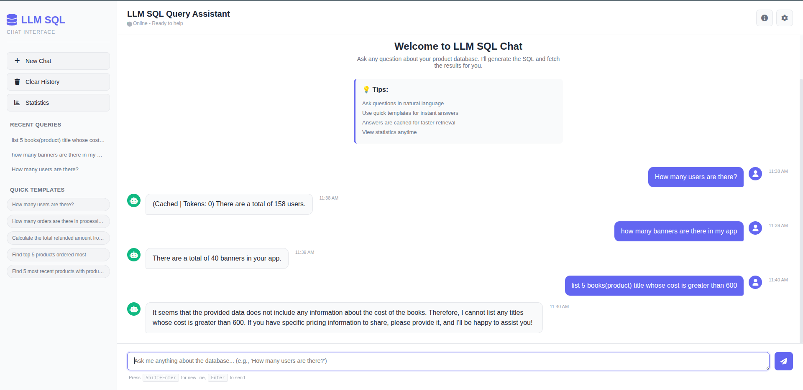

# LLM SQL Query Tool

A sophisticated AI-powered system that converts natural language questions into SQL queries and executes them against a MySQL database. Built with OpenAI's GPT-4, FastMCP protocol, and intelligent caching mechanisms.

## 🎯 Overview

This project bridges the gap between natural language and SQL by leveraging Large Language Models (LLM) to automatically understand user questions and generate optimized database queries. The system includes intelligent caching, template management, and token cost tracking.

### Key Features

- **Natural Language Processing**: Convert plain English questions into SQL queries
- **Intelligent Table Selection**: LLM automatically identifies relevant tables needed to answer questions
- **Smart Caching**: Redis-based caching with TTL to avoid redundant queries and API calls
- **Template System**: Store and reuse common queries and their answers
- **Cost Tracking**: Monitor OpenAI API usage and estimated costs
- **Error Handling**: Robust error management for database and API failures
- **MCP Server**: Built on Model Context Protocol for seamless integration

## 🏗️ Architecture

```
┌─────────────────────────────────────────────────┐
│          User Question (Natural Language)       │
└─────────────────────┬───────────────────────────┘
                      │
                      ▼
        ┌─────────────────────────────┐
        │  Template/Cache Check       │
        │ (Redis + templates.json)    │
        └─────────────────┬───────────┘
                          │
         ┌────────────────┴────────────────┐
         │ Cache Hit?                      │
         │ (Return Cached Answer)          │
         │ Cache Miss ↓                    │
         │                                │
         ▼                                │
    ┌────────────────────────┐           │
    │ Get Relevant Tables    │           │
    │ (LLM: GPT-4o)          │           │
    └────────────┬───────────┘           │
                 │                       │
                 ▼                       │
    ┌────────────────────────┐           │
    │ Fetch Table Schema     │           │
    │ (MySQL Database)       │           │
    └────────────┬───────────┘           │
                 │                       │
                 ▼                       │
    ┌────────────────────────┐           │
    │ Generate SQL Query     │           │
    │ (LLM: GPT-4o)          │           │
    └────────────┬───────────┘           │
                 │                       │
                 ▼                       │
    ┌────────────────────────┐           │
    │ Execute SQL Query      │────────────┐
    │ (MySQL Database)       │           │
    └────────────┬───────────┘           │
                 │                       │
                 ▼                       ▼
    ┌────────────────────────────────────────┐
    │ Format Answer & Cache Result           │
    │ (Store in Redis + templates.json)      │
    └────────────┬─────────────────────────┘
                 │
                 ▼
    ┌────────────────────────┐
    │ Return Answer to User  │
    └────────────────────────┘
```

## 🌐 Full System Architecture (With Web Interface)

```
┌────────────────────────────────────────────────────────────────┐
│                      User Browser                              │
│                  (Web Chat Interface)                           │
│        http://localhost:5000 - Beautiful UI Interface           │
└────────────────────┬───────────────────────────────────────────┘
                     │ HTTP Requests
                     │ (JSON over HTTP)
                     ▼
        ┌─────────────────────────────┐
        │   Flask Web Client          │
        │      (client.py)            │
        │                             │
        │  - REST API Endpoints       │
        │  - Session Management       │
        │  - Message Routing          │
        │  - Error Handling           │
        └────────────┬────────────────┘
                     │
                     │ MCP Protocol / Function Calls
                     │
                     ▼
        ┌─────────────────────────────────────────────┐
        │     MCP Server (Main Query Processor)        │
        │          (main.py or main.py)              │
        │                                              │
        │  - Natural Language Understanding            │
        │  - Table Selection (LLM)                     │
        │  - SQL Generation (LLM)                      │
        │  - Query Execution                           │
        │  - Result Caching                            │
        └────────┬──────────────────┬─────────────────┘
                 │                  │
        ┌────────▼──────┐    ┌──────▼──────────┐
        │   MySQL DB    │    │   Redis Cache   │
        │               │    │                 │
        │ - Execute     │    │ - Store Results │
        │   Queries     │    │ - TTL Cache     │
        │ - Schema Ops  │    │ - Fast Lookups  │
        └───────────────┘    └────────┬────────┘
                                      │
                             ┌────────▼─────────┐
                             │ templates.json    │
                             │                   │
                             │ - Query Templates │
                             │ - Preset Answers  │
                             │ - Usage Stats     │
                             └───────────────────┘

        ┌────────────────────────────────────────┐
        │  OpenAI GPT-4o (External LLM)          │
        │                                         │
        │  - Table Selection                      │
        │  - SQL Generation                       │
        │  - Answer Formatting                    │
        └────────────────────────────────────────┘
```

## 📸 Interface Preview

The web interface includes:
- **Chat Interface**: Beautiful message-based UI
- **Dark Mode**: Toggle between light and dark themes
- **Real-time Updates**: Instant message display
- **Query History**: See all recent queries
- **Statistics**: Monitor usage and cache hits
- **Templates**: Quick suggestions for common queries

*Add your screenshot to `static/image.png` for visual documentation*

```
llm_sql/
├── main.py                  # Primary MCP server with core functionality
├── main.py               # Alternative version with enhanced structure
├── client.py               # Flask web interface client
├── database.py             # MySQL database operations
├── cache.py                # Redis caching utility
├── templates.json          # Cached queries and answers storage
├── requirements.txt        # Python dependencies
├── README.md              # Main documentation
├── WEBINTERFACE.md        # Web interface guide
├── static/                # Frontend assets
│   ├── style.css          # CSS styling
│   ├── script.js          # JavaScript frontend
│   └── image.png          # Interface screenshot (add your image here)
└── templates/             # HTML templates
    └── index.html         # Chat interface HTML
```

### File Descriptions

- **[main.py](main.py)**: FastMCP server that orchestrates the entire workflow
  - `ask_product_data()`: Main tool for processing natural language questions
  - `get_relevant_tables()`: Identifies necessary tables using LLM
  - `get_sql_from_llm()`: Generates SQL from natural language
  - Template management for caching

- **[main.py](main.py)**: Enhanced version (recommended for production)
  - Better error handling
  - Improved token usage tracking
  - Extended template system with usage analytics
  - More robust logging

- **[database.py](database.py)**: MySQL integration layer
  - `get_table_list()`: Retrieves all table names
  - `get_specific_schema()`: Gets schema for targeted tables (token-efficient)
  - `execute_read_query()`: Executes SELECT queries safely
  - Connection pooling and error handling

- **[cache.py](cache.py)**: Redis caching layer
  - `get_cached_query()`: Retrieves cached results
  - `set_cached_query()`: Stores query results with TTL
  - Environment-based configuration

- **[templates.json](templates.json)**: Template storage
  - Pre-computed query-answer pairs
  - Stores raw database results
  - LLM-generated answers
  - Token usage information

- **[client.py](client.py)**: Flask web client
  - RESTful API endpoints for chat
  - Session management
  - Query caching and statistics
  - Error handling and logging

- **[WEBINTERFACE.md](WEBINTERFACE.md)**: Web interface documentation
  - Setup and running instructions
  - Feature overview
  - Usage guide and examples
  - Keyboard shortcuts
  - Troubleshooting

- **[static/](static/)**: Frontend assets
  - `style.css`: Professional CSS with dark mode
  - `script.js`: Interactive JavaScript with WebSocket support
  - `image.png`: Interface screenshot/diagram

- **[templates/](templates/)**: HTML templates
  - `index.html`: Main chat interface

## 🔧 Setup & Installation

### Prerequisites

- Python 3.8+
- MySQL Server running
- Redis Server running
- OpenAI API key

### Step 1: Clone & Navigate

```bash
cd /home/anaghk/Public/Code/llm_sql
```

### Step 2: Create Virtual Environment

```bash
python3 -m venv venv
source venv/bin/activate
```

### Step 3: Install Dependencies

```bash
pip install -r requirements.txt
```

### Step 4: Configure Environment Variables

Create a `.env` file in the project root:

```env
# OpenAI API Configuration
OPENAI_API_KEY=sk-your-api-key-here

# MySQL Database Configuration
DB_HOST=localhost
DB_USER=root
DB_PASSWORD=your_password
DB_NAME=your_database_name

# Redis Configuration
REDIS_HOST=localhost
REDIS_PORT=6379
CACHE_TTL=3600

# MCP Server Configuration
MCP_HOST=localhost
MCP_PORT=8000
```

### Step 5: Verify Connections

```bash
# Test MySQL connection
python3 database.py

# Test Redis connection
python3 cache.py

# Test OpenAI API
python3 -c "from openai import AsyncOpenAI; print('OpenAI SDK loaded')"
```

## 🚀 Running the Application

### ⚡ Quick Start - Run Both Server & Web Client

The easiest way to get started is to run both the MCP server and web client together.

#### **Option A: Using Two Terminal Windows (Recommended)**

**Terminal 1 - Start the MCP Server:**
```bash
cd /home/anaghk/Public/Code/llm_sql
source venv/bin/activate
python3 main.py
```

**Terminal 2 - Start the Web Client (in a new terminal):**
```bash
cd /home/anaghk/Public/Code/llm_sql
source venv/bin/activate
python3 client.py
```

**Then open in browser:** [http://localhost:5000](http://localhost:5000)

#### **Option B: Using a Bash Script (Automated)**

Create `run_all.sh` in the project root:

```bash
#!/bin/bash
echo "Starting LLM SQL Chat System..."
echo "================================"

# Activate virtual environment
source venv/bin/activate

# Start MCP Server in background
echo "[1/2] Starting MCP Server (main.py)..."
python3 main.py &
MCP_PID=$!
echo "     PID: $MCP_PID"

# Wait for MCP server to start
sleep 2

# Start Web Client in background
echo "[2/2] Starting Web Client (client.py)..."
python3 client.py &
WEB_PID=$!
echo "     PID: $WEB_PID"

echo ""
echo "✅ Both services started!"
echo "   - MCP Server:  Running (PID: $MCP_PID)"
echo "   - Web Client:  http://localhost:5000 (PID: $WEB_PID)"
echo ""
echo "Press Ctrl+C to stop all services..."
echo ""

# Keep script running
wait
```

Make it executable and run:
```bash
chmod +x run_all.sh
./run_all.sh
```

---

### MCP Server Only (CLI Mode)

**Option 1: Using main.py (Standard)**

```bash
source venv/bin/activate
python3 main.py
```

The MCP server will start and listen for connections.

**Option 2: Using main.py (Recommended - Enhanced Version)**

```bash
source venv/bin/activate
python3 main.py
```

Features better error handling and cost tracking.

**Option 3: Run with Environment Reload**

```bash
source venv/bin/activate
python3 main.py --reload
```

---

### Web Client Only

If the MCP server is already running elsewhere:

```bash
source venv/bin/activate
python3 client.py --host 0.0.0.0 --port 5000 --debug
```

Forwarding to a remote MCP server:

```bash
source venv/bin/activate
python3 client.py --host 0.0.0.0 --port 5000
```

---

### ✅ Quick Startup Checklist

Before running both services, verify:

- [ ] Virtual environment activated
- [ ] Dependencies installed: `pip install -r requirements.txt`
- [ ] `.env` file configured with all credentials
- [ ] MySQL server running
- [ ] Redis server running
- [ ] Ports 5000 (Flask) and any MCP ports are available

### 🔧 Starting Services - Expected Output

**Terminal 1 - MCP Server:**
```
WARNING:asyncio:... Creating LLM task...
Starting main server...
Server running...
```

**Terminal 2 - Web Client:**
```
[INFO] Using main (enhanced MCP server)
 * Running on http://localhost:5000
 * Press CTRL+C to quit
```

Once both are running, open: **http://localhost:5000**

---

## 💡 Usage Examples

Once the server is running, you can ask questions:

### Example 1: Count Total Users
```
Question: "How many users are there?"
Response: (Cached) There are a total of 158 users.
```

### Example 2: Complex Aggregation
```
Question: "From order table find top 5 products which was ordered most"
Response: Top products by order quantity with detailed breakdown
```

### Example 3: Recent Products
```
Question: "From product table find 5 products who are very recent and give product_id and title"
Response: 5 most recently added products with IDs and titles
```

## 📊 How It Works

### 1. Query Caching Strategy

The system uses a **two-tier caching approach**:

| Cache Tier | Storage | TTL | Use Case |
|-----------|---------|-----|----------|
| **L1 Cache** | templates.json | Permanent | Common/preset queries |
| **L2 Cache** | Redis | 1 hour (default) | Recently executed queries |

### 2. Token Optimization

- **Selective Schema Loading**: Only fetches schemas for identified tables (not all tables)
- **Template Reuse**: Avoids re-processing identical questions
- **Cost Tracking**: Logs token usage per query for optimization

### 3. LLM Integration Flow

1. **Table Selection**: LLM identifies relevant tables from the schema
2. **Schema Fetch**: Only retrieve schemas for selected tables
3. **Query Generation**: LLM creates optimal SQL
4. **Result Processing**: Format and cache results

## 🔌 API Endpoints

### Main Tool: `ask_product_data`

**Input:**
- `question` (string): Natural language question about product data

**Output:**
- String: Formatted answer with query results

**Example:**
```python
result = await ask_product_data("How many orders are there?")
```

## 🛠️ Configuration Options

### Database Configuration
```env
DB_HOST=localhost          # MySQL server hostname
DB_USER=root              # MySQL username
DB_PASSWORD=your_pwd      # MySQL password
DB_NAME=database_name     # Database to query
```

### Cache Configuration
```env
REDIS_HOST=localhost      # Redis server hostname
REDIS_PORT=6379          # Redis port
CACHE_TTL=3600           # Cache time-to-live in seconds
```

### API Configuration
```env
OPENAI_API_KEY=sk-...    # Your OpenAI API key
OPENAI_MODEL=gpt-4o      # Model to use (default: gpt-4o)
```

## 📈 Performance Considerations

### Caching Impact
- **First query**: ~3-5 seconds (LLM processing + DB execution)
- **Cached query**: ~50-100ms (Redis lookup)
- **Template query**: <10ms (JSON lookup)

### Token Usage
- Average simple query: 500-800 tokens
- Complex aggregation: 1000-1500 tokens
- Cost per query: ~$0.005-$0.01 (with GPT-4o)

### Optimization Tips
1. Use Redis with adequate memory
2. Regularly archive old templates
3. Monitor token usage via cost tracking in main.py
4. Index frequently queried columns in MySQL

## 🐛 Troubleshooting

| Issue | Cause | Solution |
|-------|-------|----------|
| "Database connection failed" | MySQL not running | Start MySQL: `sudo service mysql start` |
| "No cached result" first query | Cache empty | Normal - LLM will process |
| "Error connecting to Redis" | Redis not running | Start Redis: `redis-server` |
| "Invalid API key" | Wrong OpenAI key | Check `.env` file and OpenAI dashboard |
| "Table not found" (SQL error) | Wrong table name | Verify table exists in schema |
| "MCP server not initialized" (Web Client) | MCP server not running | Start MCP: `python3 main.py` in another terminal |
| "Cannot connect to Flask" (http://localhost:5000 fails) | Web client not running | Start client: `python3 client.py` |
| "Port already in use" | Another service using port 5000 | Use different port: `python3 client.py --port 8080` or kill process: `lsof -i :5000` |
| "Module import error" in client.py | Missing dependencies | Run: `pip install -r requirements.txt` |

## 📝 Environment Template

Create `.env.example` for team reference:

```env
# Copy this file to .env and fill in your values
OPENAI_API_KEY=sk-your-key
DB_HOST=localhost
DB_USER=root
DB_PASSWORD=your_password
DB_NAME=your_database
REDIS_HOST=localhost
REDIS_PORT=6379
CACHE_TTL=3600
```

## � Adding Interface Screenshots

To add visual documentation of the web interface:



## 📦 Dependencies

- **mcp**: Model Context Protocol SDK
- **mysql-connector-python**: MySQL database driver
- **redis**: Redis client library
- **python-dotenv**: Environment variable management
- **openai**: OpenAI API client (async support)
- **Flask**: Web framework
- **Flask-CORS**: CORS support for Flask

See [requirements.txt](requirements.txt) for all versions.

## 🔐 Security Best Practices

1. **Never commit `.env` file** - Add to `.gitignore`
2. **Use environment variables** for all credentials
3. **Validate user queries** - Sanitize inputs
4. **Restrict database user** - Use least privilege
5. **Enable Redis authentication** in production
6. **Use HTTPS** for API calls

## 📚 Additional Resources

- [FastMCP Documentation](https://github.com/jlowin/fastmcp)
- [OpenAI API Reference](https://platform.openai.com/docs)
- [MySQL Connector Python](https://dev.mysql.com/doc/connector-python/en/)
- [Redis Documentation](https://redis.io/documentation)

## 📝 License

This project is licensed under the MIT License - see the [LICENSE](LICENSE) file for details.

Permissions:
- ✅ Commercial use
- ✅ Modification
- ✅ Distribution
- ✅ Private use

Conditions:
- 📋 License and copyright notice required

## 👥 Contributing

Guidelines for contributors:

1. Fork the repository
2. Create a feature branch
3. Make your changes
4. Test thoroughly
5. Submit a pull request

## 📧 Support

For issues or questions:
- Check the troubleshooting section
- Review existing templates in `templates.json`
- Test database connectivity
- Verify OpenAI API credits

---

**Last Updated**: April 1, 2026  
**Version**: 1.0  
**Status**: Production Ready
